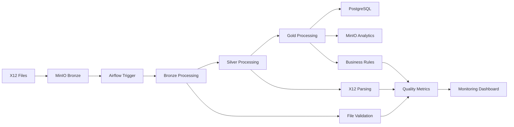

# Local X12 EDI Processing Architecture

## 📋 Table of Contents

1. [Architecture Overview](#architecture-overview)
2. [Component Details](#component-details)
3. [Data Flow](#data-flow)
4. [Service Dependencies](#service-dependencies)
5. [Storage Architecture](#storage-architecture)
6. [Security Model](#security-model)
7. [Monitoring & Observability](#monitoring--observability)
8. [Performance Characteristics](#performance-characteristics)

## 🏗️ Architecture Overview

The local X12 EDI processing environment provides a complete development and testing platform that mirrors the Azure Fabric production architecture using open-source alternatives.

### High-Level Architecture

```
┌─────────────────────────────────────────────────────────────────┐
│                    Local X12 Processing Environment             │
├─────────────────────────────────────────────────────────────────┤
│                                                                 │
│  ┌─────────────┐    ┌─────────────┐    ┌─────────────┐         │
│  │   MinIO     │    │  Airflow    │    │  Jupyter    │         │
│  │  Storage    │    │ Orchestrator│    │   Lab       │         │
│  │ (S3-like)   │    │             │    │             │         │
│  └─────────────┘    └─────────────┘    └─────────────┘         │
│         │                   │                   │              │
│         │                   │                   │              │
│  ┌─────────────┐    ┌─────────────┐    ┌─────────────┐         │
│  │ PostgreSQL  │    │    Redis    │    │  Web UI     │         │
│  │  Database   │    │   Message   │    │  Services   │         │
│  │             │    │   Queue     │    │             │         │
│  └─────────────┘    └─────────────┘    └─────────────┘         │
│                                                                 │
└─────────────────────────────────────────────────────────────────┘
```

### Service-to-Azure Mapping

| **Local Service** | **Azure Equivalent** | **Purpose** | **Production Ready** |
|-------------------|----------------------|-------------|---------------------|
| **MinIO** | Azure Storage (Data Lake Gen2) | Object storage for medallion architecture | ✅ Yes |
| **Apache Airflow** | Azure Data Factory | Pipeline orchestration and scheduling | ✅ Yes |
| **Jupyter Lab** | Azure Fabric Notebooks | Interactive development and analysis | ⚠️ Development only |
| **PostgreSQL** | Azure SQL Database / Cosmos DB | Structured data storage | ✅ Yes |
| **Redis** | Azure Service Bus | Message queuing and caching | ✅ Yes |

## 🔧 Component Details

### MinIO Storage Service

**Purpose**: Provides S3-compatible object storage for the medallion data architecture.

**Configuration**:
```yaml
minio:
  image: minio/minio:latest
  ports:
    - "9000:9000"  # API endpoint
    - "9001:9001"  # Web console
  environment:
    MINIO_ROOT_USER: minioadmin
    MINIO_ROOT_PASSWORD: minioadmin123
```

**Storage Buckets**:
- `bronze-x12-raw` - Raw X12 files with basic validation
- `silver-x12-parsed` - Parsed and structured data
- `gold-x12-business` - Business-ready analytics
- `archive-x12` - Processed file archive

**Key Features**:
- S3-compatible API
- Web-based management console
- Versioning and lifecycle policies
- Multi-tenant bucket isolation

### Apache Airflow Orchestration

**Purpose**: Manages ETL pipeline scheduling, monitoring, and execution.

**Architecture**:
```yaml
airflow-webserver:   # Web UI and API server
airflow-scheduler:   # Task scheduling engine  
airflow-worker:      # Task execution worker
postgres:           # Metadata database
redis:              # Message broker for Celery
```

**Key Features**:
- DAG-based pipeline definition
- Rich web UI for monitoring
- Scalable worker architecture
- Extensive logging and alerting
- REST API for external integration

**Pipeline Definition**: `local-development/airflow/dags/x12_processing_dag.py`

### Jupyter Lab Development Environment

**Purpose**: Interactive development, testing, and analysis of X12 processing logic.

**Configuration**:
```yaml
jupyter:
  image: jupyter/pyspark-notebook:latest
  ports:
    - "8888:8888"
  volumes:
    - ./notebooks:/home/jovyan/work/notebooks
    - ./testdata:/home/jovyan/work/data/input
```

**Capabilities**:
- Python 3.11 with PySpark
- Pre-installed data science libraries
- Direct access to MinIO and PostgreSQL
- Notebook sharing and version control

### PostgreSQL Data Storage

**Purpose**: Stores structured X12 data in medallion architecture tables.

**Schema Design**:
```sql
-- Bronze Layer
bronze_x12              -- Raw file metadata
processing_audit         -- Execution tracking

-- Silver Layer  
silver_transactions      -- Parsed X12 transactions
silver_segments         -- Individual X12 segments

-- Gold Layer
gold_transaction_summary    -- Aggregated metrics
gold_claim_analytics       -- Healthcare claim KPIs
gold_payment_analytics     -- Payment processing metrics
gold_eligibility_analytics -- Eligibility verification data
gold_data_quality_metrics  -- Quality monitoring
```

### Redis Message Queue

**Purpose**: Provides message queuing for Airflow's Celery executor.

**Configuration**:
```yaml
redis:
  image: redis:7.2-alpine
  expose:
    - 6379
```

## 📊 Data Flow

### End-to-End Processing Flow



### Detailed Processing Steps

1. **File Ingestion**
   - Monitor input directory for new X12 files
   - Validate file format and structure
   - Extract metadata (file size, timestamp, etc.)
   - Store in MinIO bronze bucket

2. **Bronze Layer Processing**
   - Basic X12 format validation
   - ISA segment verification
   - File metadata extraction
   - Storage in PostgreSQL bronze tables

3. **Silver Layer Processing**
   - X12 segment parsing
   - Data type validation
   - Business rule application
   - Quality score calculation
   - Structured data storage

4. **Gold Layer Processing**
   - Business logic application
   - KPI calculation
   - Aggregation and summarization
   - Analytics table population

## 🔗 Service Dependencies

### Startup Order

```
1. PostgreSQL (metadata storage)
2. Redis (message broker)
3. MinIO (object storage)
4. Airflow Scheduler
5. Airflow Webserver
6. Airflow Worker
7. Jupyter Lab
```

### Network Dependencies

```yaml
Networks:
  default: x12-network
  
Service Communication:
  airflow-webserver: → postgres, redis
  airflow-scheduler: → postgres, redis, minio
  airflow-worker: → postgres, redis, minio
  jupyter: → postgres, minio
```

### Volume Dependencies

```yaml
Persistent Volumes:
  minio-data: MinIO object storage
  postgres-db-volume: Airflow metadata
  data-postgres-volume: X12 processed data
  
Bind Mounts:
  ./airflow/dags: Pipeline definitions
  ./notebooks: Jupyter notebooks
  ./testdata: Sample X12 files
  ./processed: Output data
```

## 💾 Storage Architecture

### Medallion Architecture Implementation

#### Bronze Layer (Raw Data)
```
Structure:
├── bronze-x12-raw/
│   ├── healthcare/
│   │   ├── 837_claims/
│   │   ├── 835_payments/
│   │   └── 270_271_eligibility/
│   └── archive/
│       └── processed/
```

#### Silver Layer (Parsed Data)
```
Structure:
├── silver-x12-parsed/
│   ├── transactions/
│   │   ├── year=2025/
│   │   │   ├── month=09/
│   │   │   │   └── day=04/
│   └── segments/
│       ├── ISA/
│       ├── GS/
│       └── ST/
```

#### Gold Layer (Business Data)
```
Structure:
├── gold-x12-business/
│   ├── analytics/
│   │   ├── claims_summary/
│   │   ├── payment_analytics/
│   │   └── quality_metrics/
│   └── reports/
│       ├── daily/
│       ├── weekly/
│       └── monthly/
```

### Database Schema

#### Core Tables
- **bronze_x12**: Raw file metadata and validation status
- **silver_transactions**: Parsed X12 transaction records
- **gold_***: Business analytics and KPI tables

#### Audit and Monitoring
- **processing_audit**: Complete processing history
- **gold_data_quality_metrics**: Quality tracking over time

## 🔒 Security Model

### Authentication & Authorization

**Local Development**:
- Default credentials for ease of development
- No encryption in transit (localhost only)
- Basic authentication for web UIs

**Production Considerations**:
- All services support enterprise authentication
- SSL/TLS encryption for all communications
- Role-based access control (RBAC)
- Secret management integration

### Network Security

**Local Environment**:
```yaml
Network Isolation:
  - All services in docker network
  - No external exposure except web UIs
  - Host firewall protection
```

**Secrets Management**:
```yaml
Environment Variables:
  - Database passwords
  - MinIO access keys
  - Airflow authentication
```

## 📈 Monitoring & Observability

### Built-in Monitoring

**Airflow Monitoring**:
- DAG execution status
- Task success/failure rates
- Execution duration metrics
- Resource utilization

**Database Monitoring**:
- Connection pool status
- Query performance
- Storage utilization
- Transaction rates

**MinIO Monitoring**:
- Storage usage by bucket
- Request rates and latency
- Error rates

### Logging Strategy

**Log Aggregation**:
```yaml
Service Logs:
  airflow: /opt/airflow/logs/
  postgres: Docker logs
  minio: Docker logs
  jupyter: Docker logs
```

**Log Retention**:
- Development: 7 days
- Staging: 30 days  
- Production: 90+ days

### Health Checks

**Service Health Endpoints**:
- Airflow: `http://localhost:8080/health`
- MinIO: `http://localhost:9000/minio/health/live`
- PostgreSQL: Connection test via psql
- Jupyter: `http://localhost:8888`

## ⚡ Performance Characteristics

### Processing Capacity

**Single Node Limits**:
- **File Processing**: 100-500 files/minute
- **Data Throughput**: 50-100 MB/minute
- **Concurrent Tasks**: 4-8 (CPU dependent)

**Scaling Options**:
```yaml
Horizontal Scaling:
  airflow-worker: Scale to N workers
  postgres: Read replicas
  minio: Distributed mode

Vertical Scaling:
  memory: 8GB+ recommended
  CPU: 4+ cores recommended
  storage: SSD recommended
```

### Optimization Strategies

**File Processing**:
- Batch multiple small files
- Parallel processing by file type
- Streaming for large files

**Database Performance**:
- Proper indexing strategy
- Partitioning by date
- Regular VACUUM and ANALYZE

**Storage Optimization**:
- Lifecycle policies for archival
- Compression for cold storage
- Efficient partitioning scheme

### Resource Requirements

**Minimum System Requirements**:
```yaml
Development:
  RAM: 8GB
  CPU: 4 cores
  Storage: 50GB SSD
  
Production-Like:
  RAM: 16GB+
  CPU: 8+ cores  
  Storage: 500GB+ SSD
```

**Docker Resource Allocation**:
```yaml
Per Service:
  airflow-worker: 2GB RAM, 1 CPU
  postgres: 1GB RAM, 0.5 CPU
  minio: 512MB RAM, 0.5 CPU
  jupyter: 2GB RAM, 1 CPU
  redis: 256MB RAM, 0.25 CPU
```

This architecture provides a robust, scalable foundation for X12 EDI processing that can seamlessly transition from local development to production Azure deployment.